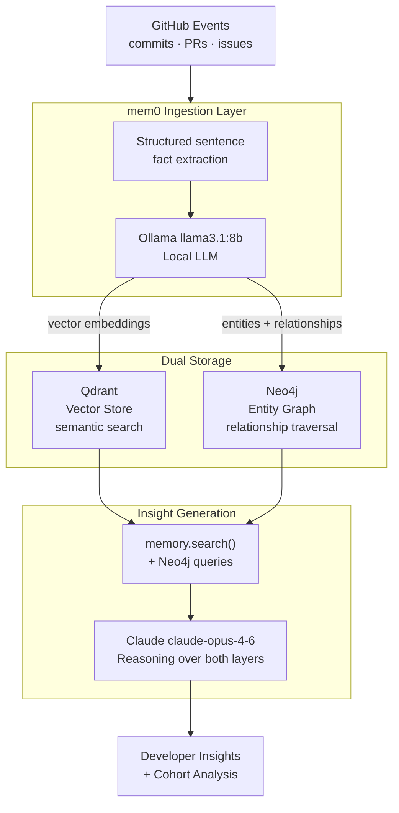

# mem0 Pipeline

Memory pipeline using mem0, Qdrant, Neo4j, and Claude — ingests GitHub developer activity, builds an entity knowledge graph, and generates developer insights.


> *Portfolio extraction of KodeKloud POC work, Mar–Apr 2026. Commit timeline reflects the original development.*

---

## What This Is

A production-style memory pipeline that turns raw GitHub activity into a structured, queryable knowledge graph — and uses Claude to reason over it.

Unlike plain RAG (retrieve → answer), this pipeline:
- **Extracts structured facts** from raw event text via mem0
- **Stores vector embeddings** in Qdrant for semantic search
- **Builds an entity graph** in Neo4j (developer → PR → repository relationships)
- **Reasons across both layers** using Claude for deep insights

---

## Architecture



### Three-Layer Memory

| Layer | Technology | Best for |
|---|---|---|
| **Vector store** | Qdrant | "What does Alice work on?" — semantic similarity |
| **Entity graph** | Neo4j | "Who collaborates with Alice?" — relationship traversal |
| **Fact extraction** | mem0 + Ollama | Turning raw event text into structured memories |

### Why Three Layers Beat Plain RAG

Plain RAG stores raw text and retrieves by similarity. This pipeline stores **structured facts** and retrieves by both **semantic similarity** (Qdrant) and **graph relationships** (Neo4j).

Example: "Who has the most context on the auth-service?"
- RAG: Returns documents mentioning auth-service
- This pipeline: Traverses Neo4j → finds alice (8 commits) + carol (TLS rotation) → cross-references Qdrant for context depth → Claude synthesises a specific answer

---

## Key Engineering Decisions

**1. Structured sentences over raw JSON for mem0 ingestion**

Structured natural-language sentences give the LLM better signal for both embedding and entity extraction than raw key-value data:

```
# Good — preserves context, extracts cleanly
"alice merged PR #45 which refactored the auth module on 2026-04-11"

# Bad — LLM produces noisy, low-quality entities
{"author": "alice", "pr": 45, "repo": "auth-service"}
```

**2. Scoped entity extraction prompt**

The default mem0 extractor produces garbage nodes — abstract states like `retry_loop`, `off_path`, numeric ratios. A tightly scoped custom prompt constraining *what counts as an entity* reduced graph noise by ~80%:

```python
custom_prompt = (
    "Only extract entities that are: a specific person (exact username), "
    "a specific repository name, or a specific technical component. "
    "Do NOT extract states, ratios, abstract concepts, or generic words."
)
```

**3. Separation of retrieval and reasoning**

Claude never calls mem0 directly. The pipeline retrieves facts via `memory.search()` and graph data via Neo4j queries, then passes both to Claude as context. This keeps retrieval deterministic and reasoning in Claude.

---

## Tech Stack

| Component | Technology | Purpose |
|---|---|---|
| Memory system | [mem0](https://mem0.ai) | Fact extraction + memory management |
| Vector store | [Qdrant](https://qdrant.tech) | Semantic search over facts |
| Knowledge graph | [Neo4j](https://neo4j.com) | Entity relationships |
| Local LLM | [Ollama](https://ollama.ai) (llama3.1:8b) | Fact extraction, embeddings |
| Insight LLM | [Claude](https://anthropic.com) (claude-opus-4-6) | Reasoning, insight generation |
| Data source | GitHub API (PyGithub) | Developer activity events |
| Schemas | Pydantic v2 | Type-safe data models |

---

## Configuration

| Variable | Required | Default | Description |
|----------|----------|---------|-------------|
| `ANTHROPIC_API_KEY` | Yes | — | Claude API key for insight generation |
| `DEMO_MODE` | No | `true` | Use mock GitHub events — no GitHub token needed |
| `GITHUB_TOKEN` | If DEMO_MODE=false | — | GitHub personal access token |
| `GITHUB_REPO` | If DEMO_MODE=false | — | Target repo (e.g. `org/repo`) |
| `NEO4J_URI` | No | `bolt://localhost:7687` | Neo4j connection |
| `NEO4J_USER` | No | `neo4j` | Neo4j username |
| `NEO4J_PASSWORD` | No | `password` | Neo4j password |
| `QDRANT_HOST` | No | `localhost` | Qdrant host |
| `QDRANT_PORT` | No | `6333` | Qdrant port |
| `OLLAMA_HOST` | No | `http://localhost:11434` | Ollama endpoint |

---

## Quick Start

### 1. Start infrastructure

```bash
cp .env.example .env
# Fill in ANTHROPIC_API_KEY
# Leave DEMO_MODE=true to run without GitHub credentials

docker compose up -d
# First run pulls Ollama models — takes ~5 mins
```

### 2. Install + run

```bash
pip install -r requirements.txt
python main.py
```

### 3. Explore

| UI | URL |
|---|---|
| Qdrant Dashboard | http://localhost:6333/dashboard |
| Neo4j Browser | http://localhost:7474 |

---

## Project Structure

```
mem0-pipeline/
├── pipeline/
│   ├── memory_store.py       # mem0 — Qdrant + Neo4j + Ollama config
│   ├── ingestion.py          # GitHub events → mem0 add()
│   └── insight_generator.py  # mem0 search() + Neo4j → Claude
├── graph/
│   └── neo4j_client.py       # Knowledge graph queries
├── models/
│   └── schemas.py            # Pydantic schemas
├── demo/
│   └── mock_github_events.json
├── main.py
└── docker-compose.yml
```

---

## Related

[dual-agent-memory](https://github.com/TanishkaMarrott/dual-agent-memory) — Two Claude agents with shared Hindsight memory bank (different memory architecture, same author)

---

## Author

Built by [Tanishka Marrott](https://github.com/TanishkaMarrott) — AI Agent Systems Engineer
