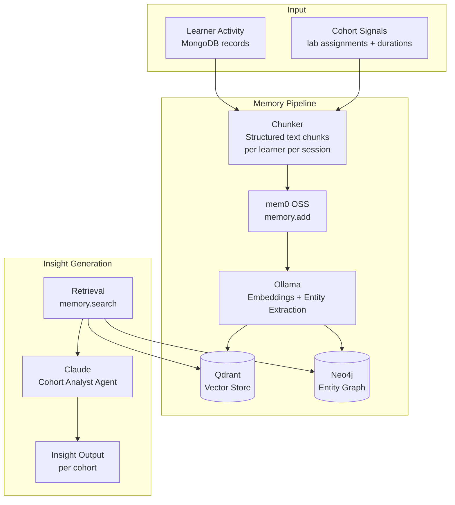

# Learner Intelligence Pipeline

A behavioural memory and cohort intelligence system that analyses learner activity signals from AWS lab environments, builds a persistent entity graph, and generates cohort-level insights using LLM reasoning.

> Built as part of my engineering role at KodeKloud. Full implementation is proprietary — this repository documents the architecture, memory design, and pipeline decisions.

---

## Overview

The learner intelligence pipeline sits inside a larger [AI Sentinel Ecosystem](https://github.com/TanishkaMarrott/ai-sentinel-ecosystem). Its job is to turn raw learner activity data (lab assignments, durations, completion patterns, retry behaviour) into structured behavioural memory — and then reason over that memory to surface cohort-level insights.

The system uses **mem0 OSS** as the memory layer, backed by:
- **Qdrant** — vector store for semantic similarity search over learner memories
- **Neo4j** — entity graph for relationship modelling (learner → lab type → AWS service)
- **Ollama** — local LLM and embedding model (no external API dependency for memory ops)

Insight generation is handled by **Claude** via the Claude Code Agent SDK.

---

## System Architecture



---

## Memory Design

### What gets stored

Each memory chunk is a structured natural-language sentence derived from learner activity:

```
alice@test.com completed AWS_EC2 in 45 minutes — faster than cohort average (62 min).
alice@test.com attempted iam:AttachRolePolicy 6 times before success — retry pattern detected.
alice@test.com has completed 4 of 7 assigned labs. Remaining: AWS_S3, AWS_Lambda, AWS_RDS.
```

**Design rationale:** Structured sentences (not raw JSON) give the LLM the best signal for both embedding (semantic search) and entity extraction (graph). Free-form text produces better retrieval than key-value pairs because it preserves context.

### Chunking strategy

Activity records are chunked into 4 categories per session:
1. **Completion chunk** — lab name, duration, relative performance vs cohort
2. **Behaviour chunk** — retry counts, stuck indicators, API action patterns
3. **Progress chunk** — overall lab completion rate, remaining labs
4. **Cohort context chunk** — where this learner sits relative to peers

Each chunk is stored as a separate `memory.add()` call so retrieval can surface the most relevant slice without loading an entire session history.

---

## Entity Graph Design

The Neo4j graph models three entity types and their relationships:

```
(alice@test.com) --[COMPLETED]--> (AWS_EC2)
(alice@test.com) --[STRUGGLED_WITH]--> (iam:AttachRolePolicy)
(alice@test.com) --[AHEAD_OF_COHORT_IN]--> (AWS_EC2)
(bob@test.com)   --[COMPLETED]--> (AWS_EC2)
(bob@test.com)   --[BEHIND_COHORT_IN]--> (AWS_S3)
(AWS_EC2)        --[INVOLVES]--> (ec2:RunInstances)
```

**Entity extraction prompt design:**

The default mem0 entity extractor produces garbage nodes — abstract concepts like `retry_loop`, `off_cohort_path`, `6.7x`, states like `stuck`. These pollute the graph and break relationship queries.

The fix is a tightly scoped `custom_prompt` that explicitly constrains what counts as an entity:

```python
custom_prompt = (
    "Only extract entities that are: "
    "(1) a specific learner — the entity name MUST be the exact user_id string "
    "(e.g. alice@test.com). Do NOT prepend 'user_id:', 'user:', or any prefix. "
    "(2) a specific AWS lab type exactly as written (e.g. AWS_EC2, AWS_S3), "
    "(3) a specific AWS service or API action (e.g. iam:AttachRolePolicy, ec2:RunInstances). "
    "Do NOT extract states, ratios, abstract concepts, or generic words as entities."
)
```

This reduced graph noise by ~80% and made relationship queries reliable.

---

## mem0 OSS Stack

| Component | Role | Config |
|-----------|------|--------|
| Qdrant | Vector similarity search over learner memories | Local instance, cosine similarity |
| Neo4j | Entity relationship graph | Local instance, custom extraction prompt |
| Ollama | Embeddings + entity extraction LLM | `nomic-embed-text` for embeddings, `llama3` for extraction |
| Claude | Cohort insight generation | Claude Code Agent SDK, `claude-sonnet` model |

**Why OSS instead of mem0 Cloud?**
- No external API dependency for memory operations — embeddings and extraction run locally
- Full control over entity extraction behaviour (custom prompts, graph schema)
- Qdrant and Neo4j can be inspected directly for debugging
- Zero per-call cost for memory operations

---

## Insight Generation

Claude retrieves memories for a cohort using `memory.search()` and reasons over them to generate insights:

**Example output:**
```
Cohort: batch-2026-Q1

Patterns observed:
- 3 of 6 learners show retry patterns on iam:AttachRolePolicy — suggest adding a
  guided hint at the IAM permissions step
- alice@test.com and carol@test.com are tracking 40% ahead of cohort average
  across all labs — candidates for advanced lab assignments
- 2 learners (bob@test.com, dave@test.com) have not started AWS_Lambda after
  completing AWS_EC2 — potential drop-off point, worth a nudge
```

The agent does not have access to raw database records — it only sees what has been stored in memory. This keeps the context clean and ensures insights are derived from the distilled behavioural signal, not raw noise.

---

## Integration

The pipeline runs as a Dockerised worker alongside the other sentinel agents:

```
FastAPI backend (MongoDB)
    └── /api/aws/sentinels/learner-intelligence/trigger
            └── li_runner.py (worker)
                    ├── Chunker → mem0.add() [Qdrant + Neo4j + Ollama]
                    └── Claude Agent → memory.search() → cohort insights
```

Parallel session support: up to 2 learner sessions processed concurrently via a semaphore-gated thread pool. Each session is tracked in MongoDB (`is_runs` collection) with status, kill signal support, and completion timestamps.

---

## Key Engineering Challenges

**1. KeyError in mem0 graph_memory.py**
mem0's entity extraction occasionally returns malformed dicts (missing `source`, `destination`, or `relationship` keys) when the LLM output doesn't conform to the expected schema. This killed the entire `memory.add()` call — including the Qdrant write.

Fix: patched 4 locations in `graph_memory.py` to skip malformed entity dicts gracefully. Applied as a post-install patch in the Docker build step.

**2. In-memory lock leak on agent kill**
When a running agent was killed via the API, the MongoDB record was updated but the in-memory semaphore and running-accounts set were not released. This caused all subsequent triggers to be rejected with "already processing in another worker."

Fix: `kill_agent` now explicitly releases the semaphore slot and discards the account from the in-memory running set before returning.

**3. LLM entity naming inconsistency**
Neo4j nodes for the same learner were created with different names (`alice@test.com` vs `user_id:alice@test.com` vs `user:alice`) depending on LLM output variability. This fragmented the graph.

Fix: explicit "Do NOT prepend any prefix" instruction in the custom entity extraction prompt, plus a one-time graph cleanup pass to merge duplicate nodes.

---

## Tech Stack

| Layer | Technology |
|-------|-----------|
| Agent framework | Claude Code Agent SDK |
| Memory layer | mem0 OSS 1.0.7 |
| Vector store | Qdrant |
| Entity graph | Neo4j |
| Local LLM / embeddings | Ollama (llama3 + nomic-embed-text) |
| Insight generation | Claude (claude-sonnet) |
| Backend | FastAPI + MongoDB |
| Infrastructure | Docker + GitLab CI/CD |

---

*Architecture and design by Tanishka Marrott. Implementation is proprietary to KodeKloud.*
